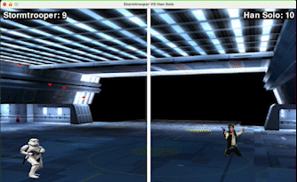

# 🎮 Star Wars: Space Duel! 🎮


Dive into the Star Wars galaxy and get ready for an epic showdown between two legendary characters: Han Solo and a relentless Stormtrooper. Take control of your character, dodge enemy shots, and showcase your skills with the laser pistol.
## Description
This is an arcade-style game 🕹️ created with . You can play 1️⃣ 🆚 1️⃣ with a friend using the same keyboard. 

Each player has 10 lives ♥️ and will take on the role of either Han Solo or a Stormtrooper.

My objective with this game was to learn the basics of , in order to create different mini-games in the future for fun. 
I hope you enjoy it, and I invite you to collaborate to improve it or create new games if you wish.
## Demonstration
There are two playable characters:
|  |  |
|:---:|:---:|
| **Han Solo** | **Stormtrooper** |

The quality of the gif is low, you'll find out later on when you download it that it is better 🤙

<p align="left">
  
</p>

## Instructions
To play the Star Wars game in your local environment, follow these steps:

### Clone the Repository

1. Open a terminal or command prompt on your system.
2. Navigate to the location where you want to clone the repository.
3. Run the following command to clone the repository:

``` 
git clone https://github.com/pedrollamas/Star_wars_pygame.git 
```

### Install Dependencies
1. Make sure you have Python installed on your system.
2. Navigate to the root folder of the cloned repository.
3. Run the following command to install the dependencies:
```
pip install -r requirements.txt
```
### Run the Game
In the same location as the root folder, run the following command to start the game:
```
python star_wars.py
```
Once the command is executed, the game will open in a new window, and you can start playing.

## Controls
#### For the Stormtrooper:

Move Up: W
Move Down: S
Move Left: A
Move Right: D
Shoot: Caps lock key (Press to shoot)

#### For Han Solo:
Move Up: Up Arrow
Move Down: Down Arrow
Move Left: Left Arrow
Move Right: Right Arrow
Shoot: Spacebar (Press to shoot)

To close the game, simply click the ❌ button in the window. If you want to play again, wait for 4 seconds and the game will automatically restart 🔁

🌟Enjoy the game and may the Force be with you!🌟 
